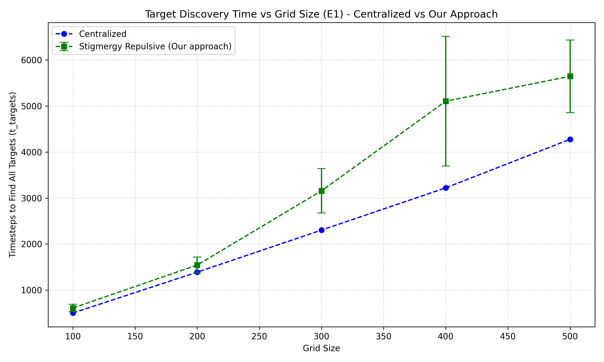
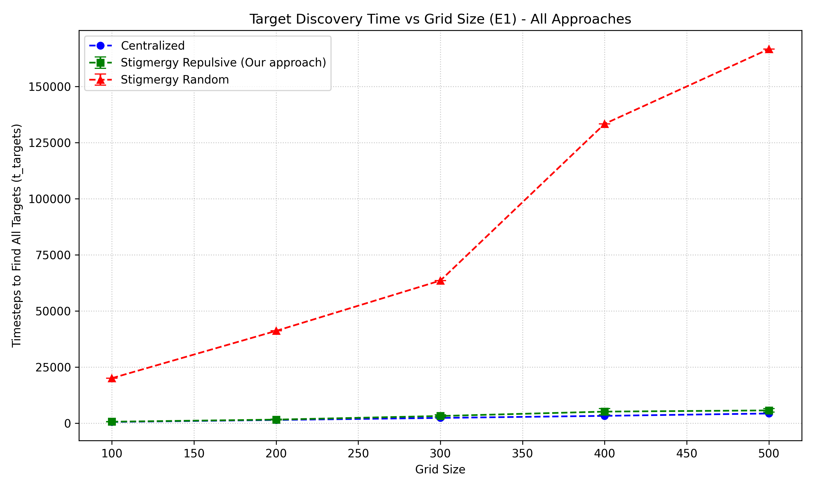

# Swarm_collaboration_via_stigmergy
To explore if stigmergy based communication can improve application of decentralized swarm systems compared to centralized systems.

## Run 

First, install dependencies:
```
pip install -r requirements.txt
```

### 1. Simulation
Navigate to `src/simulations` to run the following scripts for visualization:

```
cd src/simulations
python stigmergy_random_sim.py
python stigmergy_efficient_sim.py
python centralized_sim.py
```

### 2. Experimentation
Navigate to `src/experimentation` to run headless experiments:

```
cd src/experimentation
python stigmergy_search_efficient.py
python stigmergy_random_experiment.py
python centralized_experiment.py
```

To run multiple experiments in parallel for stigmergy random walk, you can run:
```
python stigmergy_random_experiment_multi.py
```

## Results
All results will be saved in the form of Excel sheets in the `src/experimentation/experiment_results/` folder for the respective approach. 
- The `E1` folder stores results for scenarios where `failures = 0`.
- The `E2` folder stores results for scenarios where `failures > 0`.
- **Note**: By default, experiments run without failures. To run the `E2` scenario with failures, uncomment line `17` of `src/experimentation/config.py` (i.e. `FAILURE_COUNTS = [2, 3, 4, 5, 6]`).

### 3. Visualization
To visualize the results from the experiments, navigate to `src/results_visualization` and run the plotting script:

```
cd src/results_visualization
python plot_results.py
```

This will generate plots comparing the performance of the different approaches, such as the ones below:

**1. Centralized vs Stigmergy Repulsive (Our approach)**


**2. All Approaches Included**

